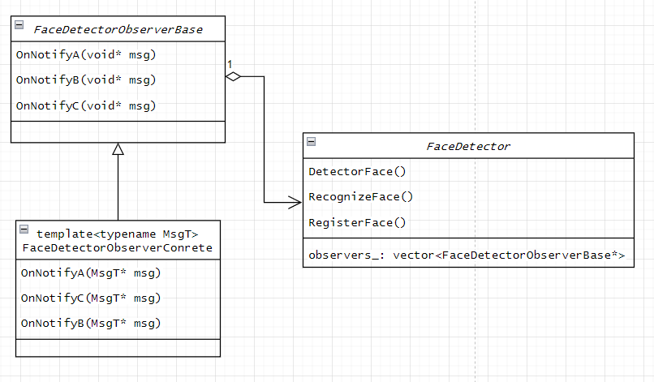

# ArmFaceID - 24/10/4 - 进度日志

## 重构：使用模板创建不同消息类型的观察者

### 重构的起因和目标

原先的接口没有考虑到引入数据库模块后的拓展性，观察者的回调函数只提供了`id:int64_t`这一种表示用户`id`的形参，观察者还需要再次通过`id`查询数据库以获取具体的用户信息，更无法获取该次检测的上下文信息（时间、来源设备、等等）。

现在尝试使用模板编程，在兼容现有代码的同时，为观察者提供自定义消息类型的功能 ~

**一些疑惑🧐：**
- 通过类型参数为观察者自定义消息类型。
- 一个被观察者能否`attach`不同消息类型的观察者？是否有这样做的必要？

### 重构前的代码：`FaceDetectorObserver` 与 `FaceDetector`
```cpp
namespace arm_face_id {
namespace interface {

class FaceDetectorObserver {
 public:
  static const int64_t kFaceNotDetected = -1;
  static const int64_t kFaceAlreadyExisted = -2;

  FaceDetectorObserver() = default;

  virtual void OnFaceDetected(cv::Mat img, vector<cv::Rect> faces) = 0;
  virtual void OnFaceRecognized(cv::Mat img, cv::Rect face, int64_t id) = 0;

  virtual void OnFaceRegistered(cv::Mat img, cv::Rect face, int64_t id) {}

 private:
};

class FaceDetector {
 public:
  FaceDetector() = default;

  inline void AddObserver(shared_ptr<FaceDetectorObserver> observer) {
    if (observer) {
      observers_.push_back(observer);
    }
  }

  inline void removeObserver(shared_ptr<FaceDetectorObserver> observer) {
    if (observer) {
      auto postion = std::find(observers_.begin(), observers_.end(), observer);
      if (postion != observers_.end()) {
        observers_.erase(postion);
      }
    }
  }

 protected:
  vector<shared_ptr<FaceDetectorObserver>> observers_;
};
```

### 重构的选择



`FaceDetectorObserverConrete` 实际上是一个中间层，通过静态类型转换获得具体类型的消息，而不需要每次都手动编写类型转换。

```cpp

// 由实际的观察者实现具体逻辑
virtual void FaceDetectorObserverConrete<MsgT>::OnNotify(MsgT* msg) = 0;

FaceDetectorObserverConrete<MsgT>::OnNotifyA(void* msg) {
  // 通过编译时类型转换，将 msg 转换为对应的消息类型
  auto msg_casted = std::static_cast<MsgT*>(msg);
  // 执行具体的回调逻辑
  OnNotifyA(msg_casted);
}
```

**一些疑惑🧐：**
- 如此设计，一个被观察者可以关联到不同消息类型的观察者（至少可以塞进观察者的`vector`里），但在通知观察者时，可能无法通过编译时的类型检查😌。
- 所以，是否需要将被观察者模板化，来保证编译时的类型安全？