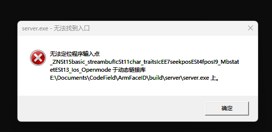

# ArmFaceID-24/8/6-进度日志

## 进度总结
在 win 构建安装 Google 的 grpc 框架，以实现人脸识别终端与服务端的通信。同时将整个项目拆分成多个工程，目前有 `client` 、`server` 、`proto` 三个模块，利用 CMake 进行构建。今日的大部分工夫都花费在理解 CMake 上，认识到 CMake 确实是构建复杂工程的实用工具。
## 问题总结

### 对 `gRpc` 以及 `protobuf` 的疑惑

#### 方法 `set_allocated_xx` 的意义？
将一个已经分配好的对象赋值给一个消息字段，避免了额外的内存分配和拷贝操作。这种方式可以确保对象的所有权清晰，因为其将指针的所有权转移了。在性能关键的应用中，这种方式可以显著减少内存分配和拷贝的开销。

`set_allocated_xx` 方法的作用：
- **直接管理内存**：允许直接将一个指针赋值给消息字段，表示消息对象现在拥有了该指针的所有权。
- **避免拷贝**：避免了将数据从一个对象拷贝到另一个对象的开销。
- **内存管理的责任转移**：在调用 `set_allocated_xx` 方法后，消息对象会负责释放该指针指向的内存。

##### 使用示例

假设有一个 `Person` 消息类型，它包含一个 `Address` 子消息类型：

```proto
message Address {
  string street = 1;
  string city = 2;
}

message Person {
  string name = 1;
  Address address = 2;
}
```

```cpp
#include "person.pb.h"
#include <iostream>

int main() {
    // 创建一个 Address 对象
    Address* address = new Address();
    address->set_street("123 Main St");
    address->set_city("Hometown");

    // 创建一个 Person 对象
    Person person;
    
    // 使用 set_allocated_address 将地址对象赋值给 person
    person.set_allocated_address(address);

    // 此时 person 对象拥有 address 的所有权，不需要再手动删除 address
    std::cout << "Name: " << person.name() << std::endl;  // 空字符串，因为未设置
    std::cout << "Street: " << person.address().street() << std::endl;
    std::cout << "City: " << person.address().city() << std::endl;

    // 当 person 被销毁时，address 的内存会被自动释放
    return 0;
}
```

在这个示例中，`address` 指针被赋值给 `person` 的 `address` 字段。此时，`person` 对象拥有了 `address` 指针的所有权，当 `person` 对象被销毁时，它会自动释放 `address` 指向的内存。

##### 注意事项

- **所有权转移**：调用 `set_allocated_xx` 后，调用者不应再使用或释放该指针，因为所有权已经转移给消息对象。
- **确保指针的唯一性**：确保在调用 `set_allocated_xx` 方法前，该指针未被其他对象拥有，以避免重复释放导致的崩溃或未定义行为。

#### `grpc`、`grpcpp`、`grpc++` 三种 API 的意义？
在使用 gRPC 的头文件时，发现其分为了三个目录，其实它们的作用在对应的头文件中有相关的说明：
```c++
#ifndef GRPC_GRPC_H
#define GRPC_GRPC_H
// ...
/*! \mainpage GRPC Core
 *
 * The GRPC Core library is a low-level library designed to be wrapped by higher
 * level libraries. The top-level API is provided in grpc.h. Security related
 * functionality lives in grpc_security.h.
 */
// ...
#endif /* GRPC_GRPC_H */
```
```c++
/// \mainpage gRPC C++ API
///
/// The gRPC C++ API mainly consists of the following classes:
/// <br>
/// - grpc::Channel, which represents the connection to an endpoint. See [the
/// gRPC Concepts page](https://grpc.io/docs/what-is-grpc/core-concepts) for
/// more details. Channels are created by the factory function
/// grpc::CreateChannel.
///
/// - grpc::CompletionQueue, the producer-consumer queue used for all
/// asynchronous communication with the gRPC runtime.
///
/// - grpc::ClientContext and grpc::ServerContext, where optional configuration
/// for an RPC can be set, such as setting custom metadata to be conveyed to the
/// peer, compression settings, authentication, etc.
///
/// - grpc::Server, representing a gRPC server, created by grpc::ServerBuilder.
///
/// Streaming calls are handled with the streaming classes in
/// \ref sync_stream.h and
/// \ref async_stream.h.
///
/// Refer to the
/// [examples](https://github.com/grpc/grpc/blob/master/examples/cpp)
/// for code putting these pieces into play.

#ifndef GRPCPP_GRPCPP_H
#define GRPCPP_GRPCPP_H
// ...
#endif // GRPCPP_GRPCPP_H
```

```c++
// DEPRECATED: The headers in include/grpc++ are deprecated. Please include the
// headers in include/grpcpp instead. This header exists only for backwards
// compatibility.

#ifndef GRPCXX_GRPCXX_H
#define GRPCXX_GRPCXX_H

#include <grpcpp/grpcpp.h>

#endif  // GRPCXX_GRPCXX_H
```

### 对 `CMake` 的疑惑

#### `gRPCConfig.cmake` 似乎没有提供 `gRPC_INCLUDE_DIRS`？
我选择修改 `gRPCConfig.cmake` ...
```cmake
# added by Yusjade
get_target_property(gRPC_INCLUDE_DIRS 
gRPC::grpc INTERFACE_INCLUDE_DIRECTORIES)
```

### 编译第三方库的`mingw`版本不同，导致无法定位程序输入点



原因时我编译 opencv 时使用的 mingw 是 Qt 附带安装的版本，与我编译使用 opencv 的程序时，使用的 mingw 版本不同，所以需要使用一致的 mingw 重新编译安装 opencv 即可解决问题。

> 🤖：使用由不同版本的 MinGW 编译的第三方库可能会引发一些问题，特别是运行时可能会出现无法找到程序输入点（entry point）的问题。这主要是由于不同版本的 MinGW 可能会使用不同版本的 GCC 编译器和不同的运行时库，这些差异会导致兼容性问题。具体来说，有以下几个方面需要注意：
>1. **ABI（Application Binary Interface）不兼容**：不同版本的 GCC 编译器可能会有不同的 ABI，这意味着它们生成的二进制文件可能无法相互兼容。在这种情况下，程序在运行时可能会找不到正确的函数或数据结构，导致无法找到程序输入点的问题。
>2. **运行时库版本不匹配**：不同版本的 MinGW 可能会带有不同版本的运行时库（如 `libgcc`, `libstdc++` 等）。如果你的程序依赖于这些库，并且这些库版本不匹配，那么在运行时可能会出现找不到符号或程序输入点的问题。
>3. **动态链接库冲突**：如果你的程序使用动态链接库，并且这些库由不同版本的 MinGW 编译，那么这些库之间可能会存在符号冲突，导致运行时错误。

> 🤖：**解决方法**
>1. **使用相同版本的 MinGW 编译所有库**：为了避免上述问题，最简单的方法是确保所有第三方库和你的程序都使用相同版本的 MinGW 编译。这可以确保 ABI 和运行时库的一致性。
>2. **静态链接**：如果可能，尽量使用静态链接库而不是动态链接库。静态链接可以避免运行时的库版本冲突问题。你可以在编译时使用 `-static` 选项来实现静态链接。
>3. **检查和匹配运行时库**：确保在运行时，所有需要的动态链接库都来自同一个版本的 MinGW。这意味着你可能需要手动管理这些库文件，确保它们版本匹配并且在系统 `PATH` 或程序目录中。
>4. **使用容器或虚拟环境**：如果你的程序需要在不同的环境中运行，考虑使用容器技术（如 Docker）或虚拟环境来确保所有依赖库的一致性。这可以隔离不同版本的库，避免冲突。

### 通过 CMake 编译生成 `proto.cc/.h` 文件

### 通过 CMake 组织多个子工程的构建
使用 `add_subdirectory` 可以为工程添加子工程目录，这样 CMake 会进入目录中根据其中的 `CMakeLists.txt` 对子工程进行构建。
```cmake
add_subdirectory(
  # 子工程目录名
)
```
如果子工程之间存在依赖关系，例如编译 `server` 时需要链接 `proto` ，则可以通过在 `server` 的 `CMakeLists.txt`  中添加链接目标（`target`）
```cmake
# 链接 gRPC 、 opencv 、和子工程 proto
target_link_libraries(server
    PUBLIC
        face_proto
        ${OpenCV_LIBS}
)
```